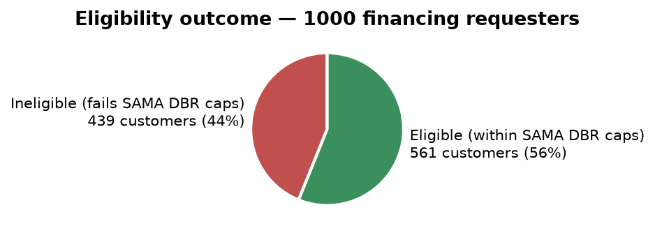
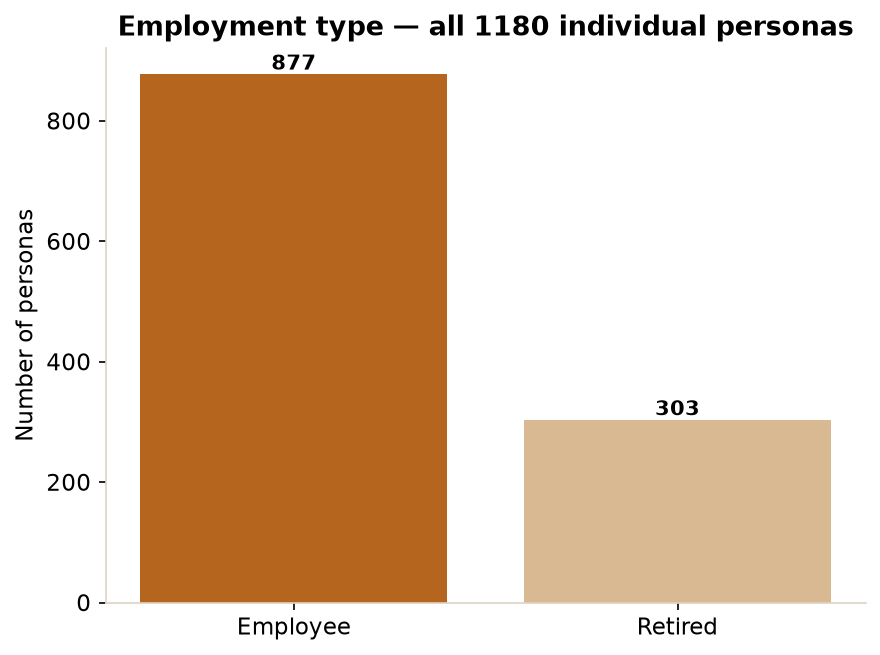
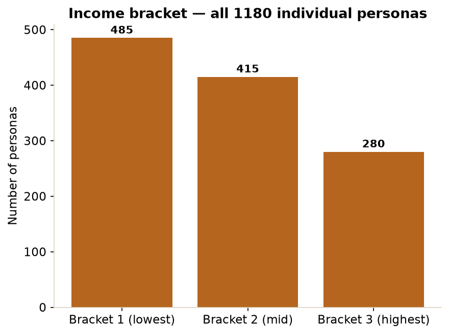
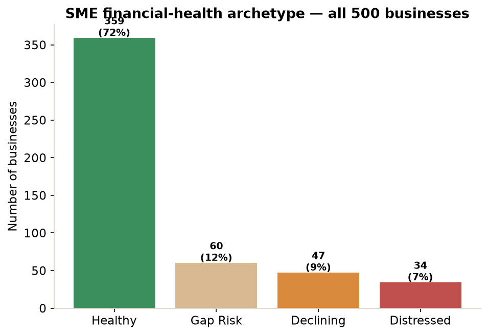
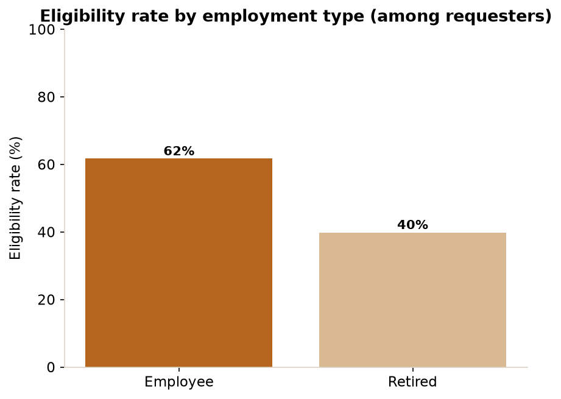
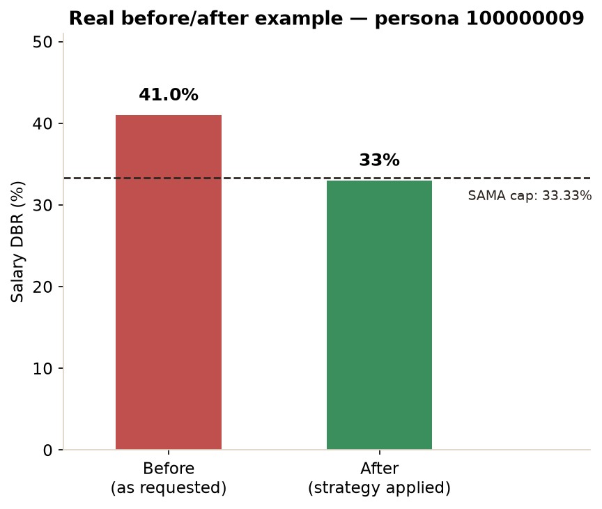

# Murtaqa — Impact Report

*A financial eligibility guide for Saudi individuals and small businesses, built on SAMA's
Responsible Lending Principles.*

---

## The problem

When a bank rejects a financing request, the applicant almost never learns *why* in a way they
can act on. They just see "rejected." Is it their income? Existing debt? The amount they asked
for? Without that answer, people either give up, reapply blindly and get rejected again, or turn
to informal, higher-cost lenders. This uncertainty is a real barrier to **financial inclusion** —
it disproportionately affects people who don't have a banker in the family or the financial
literacy to reverse-engineer a bank's internal formula.

Murtaqa closes that gap. It reads a customer's own account data (with permission, read-only —
the same "Open Banking" model regulated banks already use), and instead of a single word, it
gives them:

1. **A transparent verdict** — the exact regulatory calculation (from SAMA, the Saudi Central
   Bank) applied to their real numbers, shown in plain Arabic.
2. **A concrete way forward** — if they don't currently qualify, specific, realistic actions
   (not generic tips) that would make them eligible, with the real numbers behind each one.

## How the solution works

Murtaqa is a pipeline of five modules. Each one has a single job, and — critically — only the
math modules are allowed to produce numbers. Here's what each one does, in plain language:

### 1. Cash-flow forecasting engine
**What it does:** Looks at a customer's transaction history (income and spending over the past
24 months) and projects it forward using a time-series forecasting model (Facebook's Prophet).
**Why it matters:** A single month's snapshot can be misleading — someone might have an
unusually good or bad month. A forecast built on their actual trend gives a much more honest
picture of where their finances are actually heading.

### 2. SAMA eligibility engine
**What it does:** Takes a customer's income and existing obligations (loans, credit cards,
mortgage) and runs the exact same debt-burden-ratio formula a Saudi bank is legally required to
use, to determine whether they qualify for the financing they're requesting.
**Why it matters:** This is the heart of the transparency promise. Instead of a black-box "yes/
no," the customer sees the same math the bank used — their salary, the cap that applies to them,
and exactly how much they're over (or under) it.

### 3. Counterfactual / strategy optimizer
**What it does:** For a customer who doesn't currently qualify, this module doesn't just say
"pay off some debt" — it tries realistic combinations of specific actions (pay down a credit
card, partially settle an existing loan, ask for a smaller amount) and finds the smallest,
least disruptive change that would actually make them eligible, then double-checks that result
against the real SAMA formula before showing it.
**Why it matters:** This turns a rejection into a plan. Instead of guessing what might help, the
customer sees the exact, minimal change that works for their specific situation — not one-size-
fits-all advice.

### 4. Generative Arabic advisor
**What it does:** A local AI language model (ALLaM, an open-source Arabic model, running
entirely on-device — no cloud calls) takes the numbers the other modules already computed and
explains them in warm, clear Arabic.
**Why it matters, and the safeguard behind it:** Language models can "hallucinate" — state
numbers or facts that aren't real. Murtaqa never lets that happen: every number the AI writes is
checked against the actual computed data before it's shown to the customer, and if it can't
produce a trustworthy explanation, the customer still sees the real numbers on screen — the AI
layer is enrichment, never the source of truth.

### 5. SME readiness engine
**What it does:** Small and medium businesses aren't scored the same way as individuals (there's
no official SAMA debt-ratio for SMEs) — instead this module checks three cash-flow-based
criteria: has the business had positive cash flow for the last 3+ months, is revenue stable or
growing, and does its forecast show any negative cash-flow month coming in the next 6 months
(accounting for known upcoming obligations, not just guesswork).
**Why it matters:** Business finance is fundamentally about cash flow, not a fixed ratio — this
module evaluates SMEs the way a real lender actually thinks about business risk.

## Expected impact

- **Individuals** get a clear, actionable answer instead of a black-box rejection, which reduces
  wasted reapplications, protects them from misreading their situation, and can steer them away
  from higher-cost informal lending.
- **Retirees and lower-income applicants** — who this project's own data shows are meaningfully
  less likely to qualify (see Chart 5) — benefit most from a system that explains *why*, since
  they are the group least likely to have informal access to someone who can explain bank
  formulas to them.
- **Small businesses** get an early warning of a future cash-flow gap *before* it happens, with
  enough lead time to act, instead of discovering a shortfall the month it hits.
- **The financial system** benefits from applicants who understand and can act on the real
  requirements, which supports SAMA's own Responsible Lending goals — informed borrowers make
  better decisions, which reduces default risk on both sides.

This is a hackathon prototype on synthetic data, but the underlying regulatory logic
(`sama_rules.py`) is implemented exactly as SAMA defines it, so the same pipeline could be
connected to real Open Banking data with no change to the eligibility math itself.

---

## The data behind these numbers

All charts below are generated directly from this project's own dataset — **1,180 individual
personas** (1,000 of whom have an active financing request, 180 do not) and **500 SME
businesses** — using the real, already-computed eligibility and strategy engines. Nothing here
is estimated or invented for this report.

### Chart 1 — Eligibility outcome


*Among the 1,000 individuals who have an active financing request, 561 (56%) currently pass
SAMA's eligibility caps and 439 (44%) do not. That 44% is exactly the population Murtaqa's
strategy optimizer (module 3) is built to help — not by pretending their debt burden isn't
real, but by finding a realistic path to actually clear the caps.*

### Chart 2 — Employment type across all personas


*The dataset skews toward salaried employees, with a meaningful retiree population — the two
groups are treated differently under SAMA's rules (a 33.33% salary cap for employees vs. 25%
for retirees), which is exactly why Chart 5 shows such a different outcome for each group.*

### Chart 3 — Income bracket across all personas


*Income bracket matters beyond just the salary cap — it also determines how high a mortgage
holder's total-obligation cap can rise (55% for the lowest bracket, 65% for the two higher
brackets), so this distribution shapes who benefits most from the mortgage-aware part of the
eligibility engine.*

### Chart 4 — SME financial-health archetype


*Most simulated businesses (72%) are financially healthy, but a meaningful minority — gap-risk
(12%), declining (9%), and distressed (7%), 28% combined — are exactly the population the SME
readiness engine (module 5) is built to flag early, before a cash shortfall actually happens.*

### Chart 5 — Eligibility rate by employment type


*This is the clearest illustration of why a transparent explanation matters: retirees pass
SAMA's caps at a meaningfully lower rate (40%) than salaried employees (62%) — not because of
any unfairness in the system, but because SAMA applies a stricter 25% cap to retirees vs. 33.33%
for employees. Without Murtaqa's plain-language breakdown, a retiree has no way to know this is
the actual reason for their rejection.*

### Chart 6 — A real before/after example


*This is a real result from the live strategy optimizer, not a mocked-up example: for the
project's demo persona (account `100000009`), the requested financing initially pushes their
salary debt-burden ratio to 41.0% — over the 33.33% SAMA cap. The optimizer's top computed
strategy (paying down their credit card and partially settling their existing loan) brings that
down to 33% — inside the cap — while keeping the customer's financing request almost fully
intact (262,000 SAR of the original ~265,000 SAR requested). Every number in this chart came
directly from the same engine the live product uses.

---

## How these charts were produced

`impact_report/generate_charts.py` reads `data/processed/individuals_profiles.csv` and
`data/processed/sme_profiles.csv` directly, and calls the real `_strategy_paths()` function from
the project's own `server.py` for the before/after example — the exact same code path the live
application uses. Re-run it any time with:

```bash
python impact_report/generate_charts.py
```
